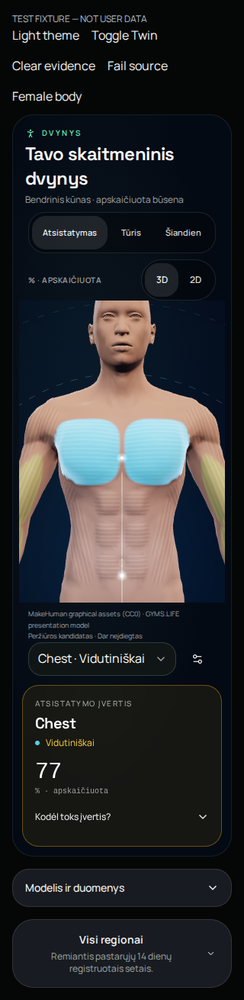
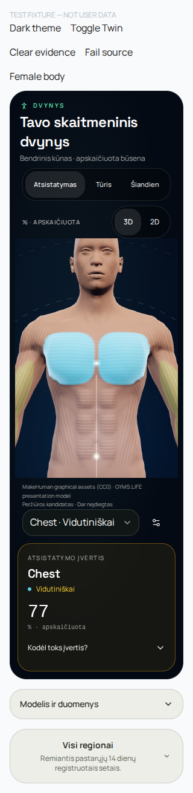
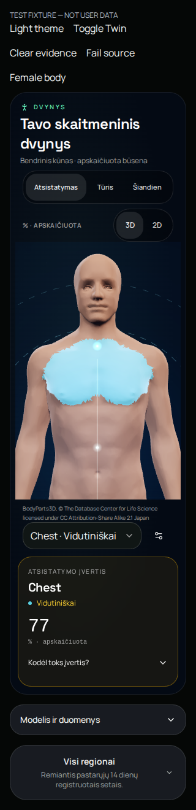
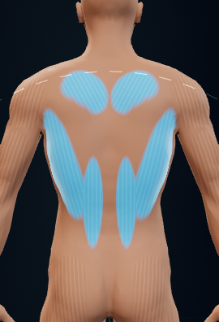
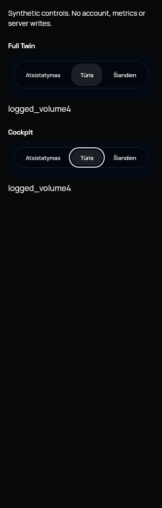
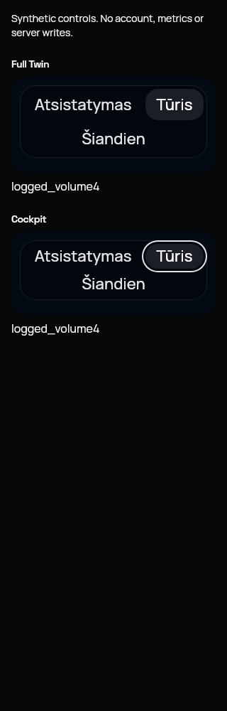
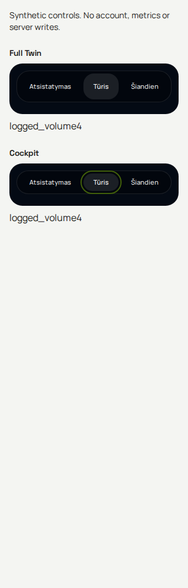
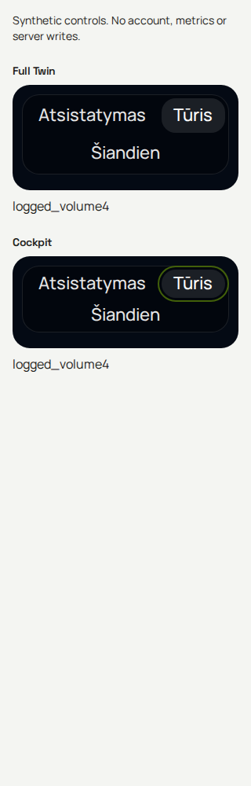

# PR148 — synthetic visual review

Exact source: `cc378262d020a196e6dacaa47911261914dbdb07`. These are existing CI screenshots, not generated designs or real-user data. No production source or deployment is changed.

## 320-dark-analysis-page.png

## 320-light-analysis-page.png

## 320-dark-realistic-page.png

## 320-dark-analysis-selected-back-no-data.png

## webkit-lt-dark-320-text1.png

## webkit-lt-dark-320-text2.png

## chromium-lt-light-320-text1.png

## chromium-lt-light-320-text2.png

