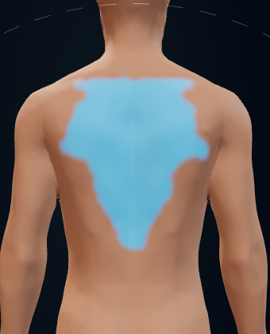
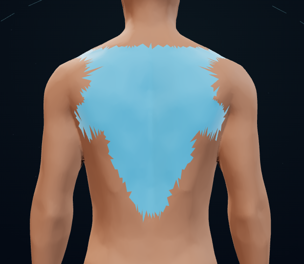
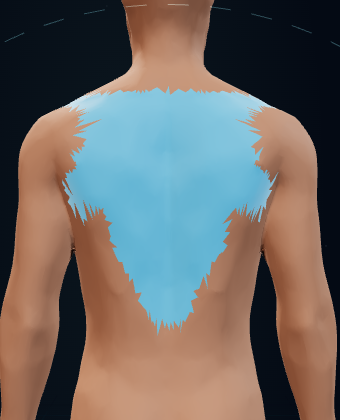

# PR149 boundary field review

Tested candidate: 1c24ecd4b408d2dac37f850bd3eede97d7345f1c

This gallery contains synthetic test screenshots only. Main and the PR branch were NOT updated by this job.

## feathered-dark-1280.png

## feathered-dark-390.png

## feathered-light-1280.png

## feathered-light-390.png

## reference-dark-1280.png

## reference-dark-390.png

## reference-light-1280.png

## reference-light-390.png

