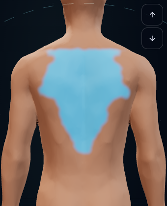
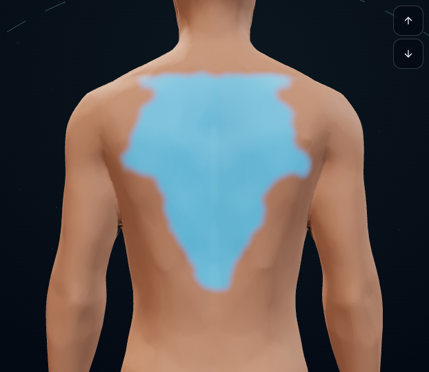
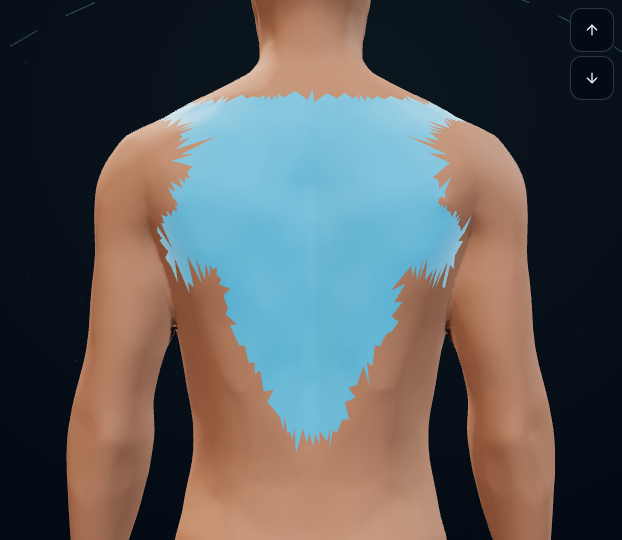
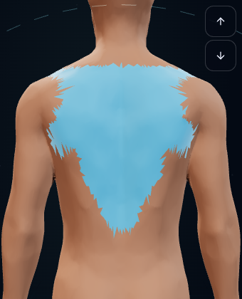
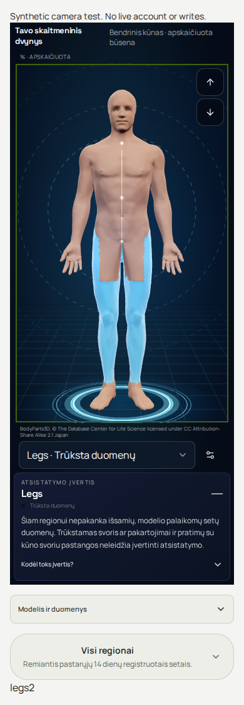

# PR150 final-head visual review

Exact application head: 112037beafb47a294f285feb3138b3b4210e5919.

All images originate from this exact head and synthetic missing-evidence fixtures. No account data, image generation or retouching. Boundary comparison reference disables feathering in the test transform; it is not a direct comparison against the old per-vertex production implementation. The camera comparison changes only viewport height to the old rule. Whole-body home captures should retain head and feet; lower-body focus intentionally crops upper parts. The stage is deliberately dark in either page theme. Fixture counters are test outputs, not app copy.

## boundary-feathered-dark-1280.png

## boundary-feathered-dark-390.png

## boundary-feathered-light-1280.png

## boundary-feathered-light-390.png

## boundary-reference-dark-1280.png

## boundary-reference-dark-390.png

## boundary-reference-light-1280.png

## boundary-reference-light-390.png

## camera-lt-dark-320-old-size.png

## camera-lt-dark-320-larger.png

## camera-lt-light-390-full.png

## camera-en-dark-1280-full.png

