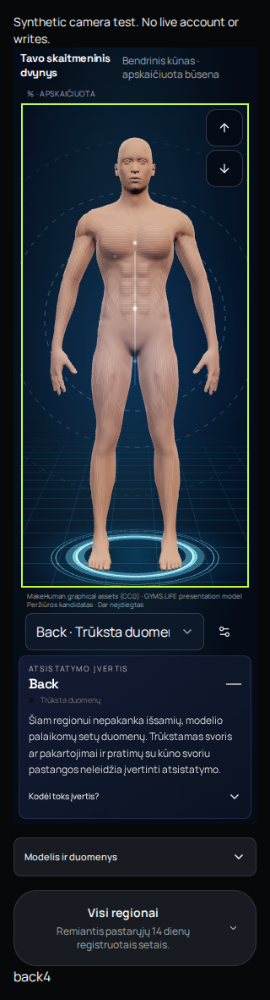
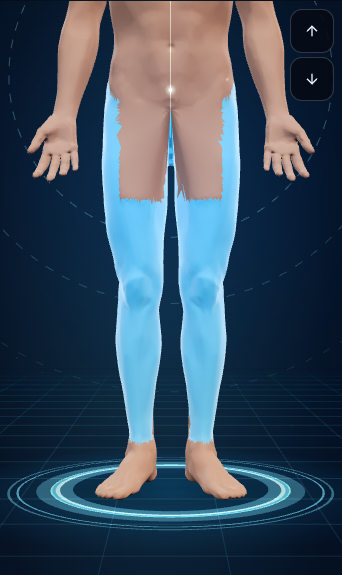
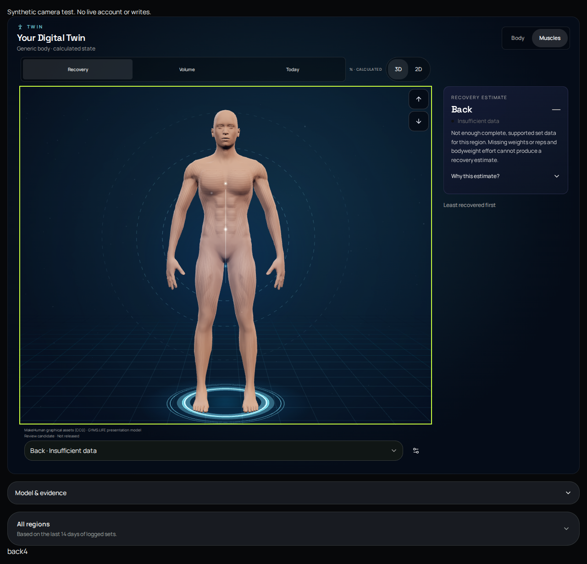
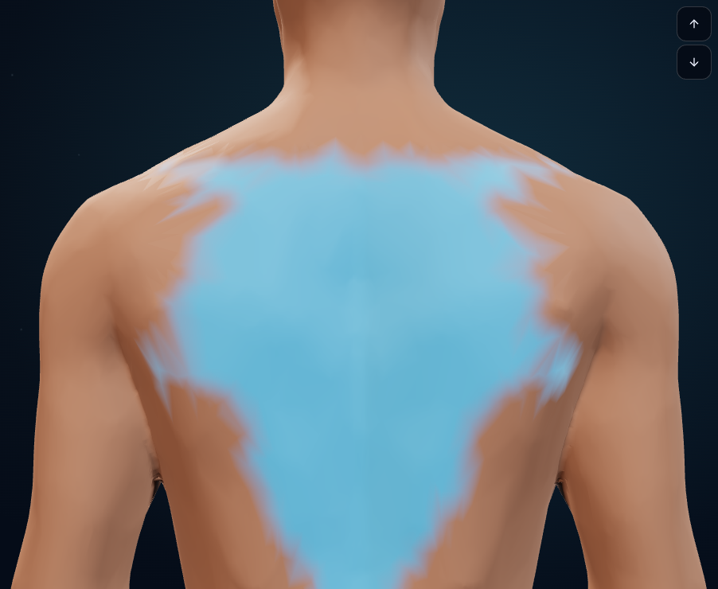

# Final-source Twin size and picking review

Reviewed application head: **2e22301c0e64931e38fd077d552560b3dfcce63d**. Exact passed source from run **37833750004**, artifact **11574861850**, digest **5edbfcf77e7242833b2ed641066daae8936e81d39f40e7480ca9d66c769c63f6**. Official artifact download verified that digest.

Six original navigation groups and twelve actual Body/Muscles picking groups passed. These are unedited synthetic screenshots of real components and registered generic models. No real account or physical-device claim. The first pair compares the same body at the old/new viewport heights; lower-body/back selected crops are intentional focused views. Tiny fixture counters are not production copy.

## lt-dark-320-old-size.png

## lt-dark-320-larger.png

## 320-dark-analysis-page.png

## 390-light-realistic-legs-selected.png

## 1280-dark-analysis-page.png

## 1280-light-realistic-back-selected.png

