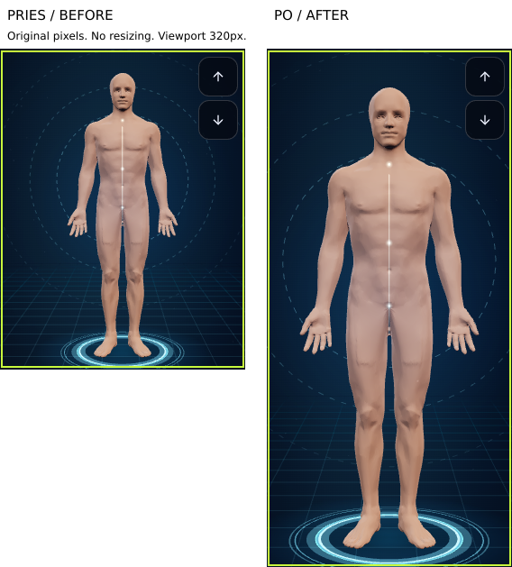
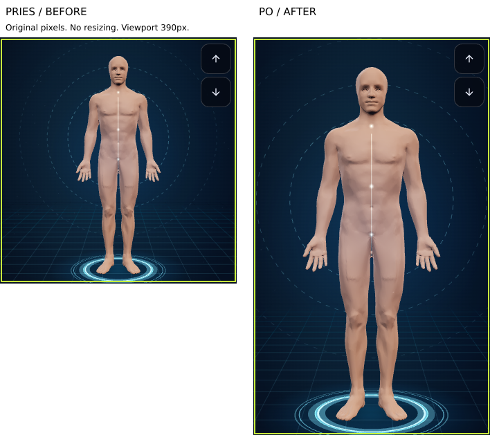
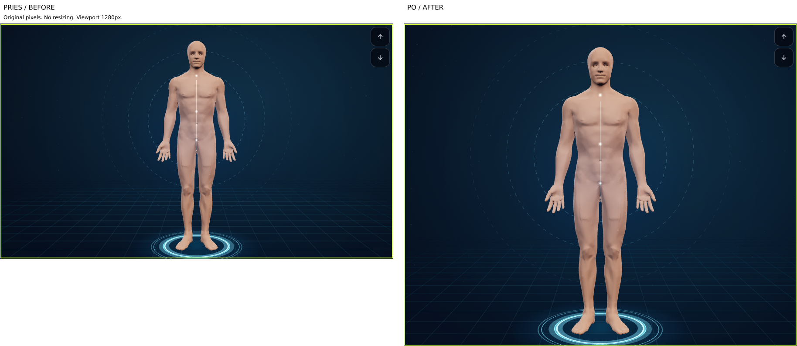

# Native-pixel Twin size review

Application 2e22301c. Original PNGs from verified artifact 11574861850. Two screenshots share one image so image viewers cannot resize each separately. No screenshot rescaling or retouching; only padding and labels were added. Skin-colour threshold is the same as the existing test; these pixel counts are not a biological measure or percentage of height.

## Viewport 320px


## Viewport 390px


## Viewport 1280px


```json
[
  {
    "viewport": 320,
    "before": {
      "width": 272,
      "height": 356,
      "skinPixels": 14093,
      "skinBounds": {
        "minX": 75,
        "minY": 27,
        "maxX": 196,
        "maxY": 341,
        "width": 122,
        "height": 315
      }
    },
    "after": {
      "width": 272,
      "height": 575,
      "skinPixels": 37342,
      "skinBounds": {
        "minX": 37,
        "minY": 43,
        "maxX": 234,
        "maxY": 554,
        "width": 198,
        "height": 512
      }
    },
    "skinPixelAreaRatio": 2.649684240403037,
    "skinBoundsHeightRatio": 1.6253968253968254,
    "composite": "comparison-320-native.png",
    "transform": "padding and labels only; neither screenshot resized"
  },
  {
    "viewport": 390,
    "before": {
      "width": 342,
      "height": 356,
      "skinPixels": 14092,
      "skinBounds": {
        "minX": 110,
        "minY": 27,
        "maxX": 231,
        "maxY": 341,
        "width": 122,
        "height": 315
      }
    },
    "after": {
      "width": 342,
      "height": 575,
      "skinPixels": 37343,
      "skinBounds": {
        "minX": 72,
        "minY": 43,
        "maxX": 269,
        "maxY": 554,
        "width": 198,
        "height": 512
      }
    },
    "skinPixelAreaRatio": 2.649943230201533,
    "skinBoundsHeightRatio": 1.6253968253968254,
    "composite": "comparison-390-native.png",
    "transform": "padding and labels only; neither screenshot resized"
  },
  {
    "viewport": 1280,
    "before": {
      "width": 902,
      "height": 540,
      "skinPixels": 33045,
      "skinBounds": {
        "minX": 358,
        "minY": 40,
        "maxX": 543,
        "maxY": 520,
        "width": 186,
        "height": 481
      }
    },
    "after": {
      "width": 902,
      "height": 740,
      "skinPixels": 62202,
      "skinBounds": {
        "minX": 323,
        "minY": 55,
        "maxX": 578,
        "maxY": 713,
        "width": 256,
        "height": 659
      }
    },
    "skinPixelAreaRatio": 1.8823422605537903,
    "skinBoundsHeightRatio": 1.37006237006237,
    "composite": "comparison-1280-native.png",
    "transform": "padding and labels only; neither screenshot resized"
  }
]
```