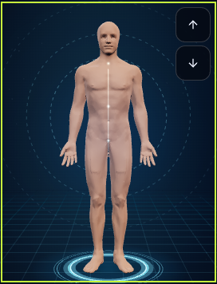
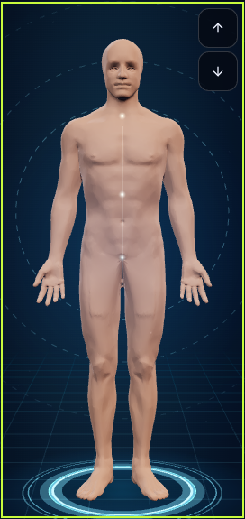
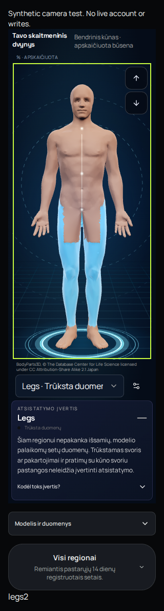
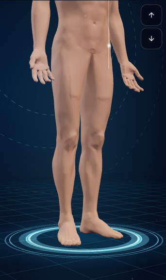
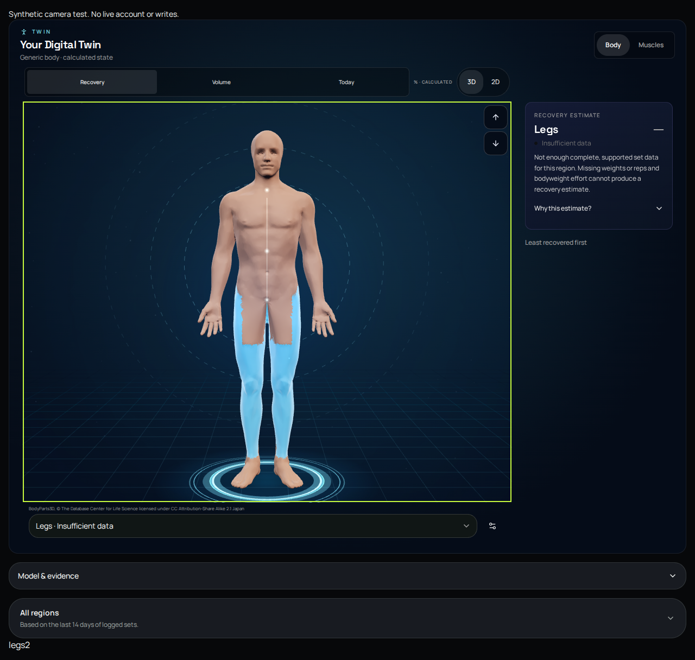
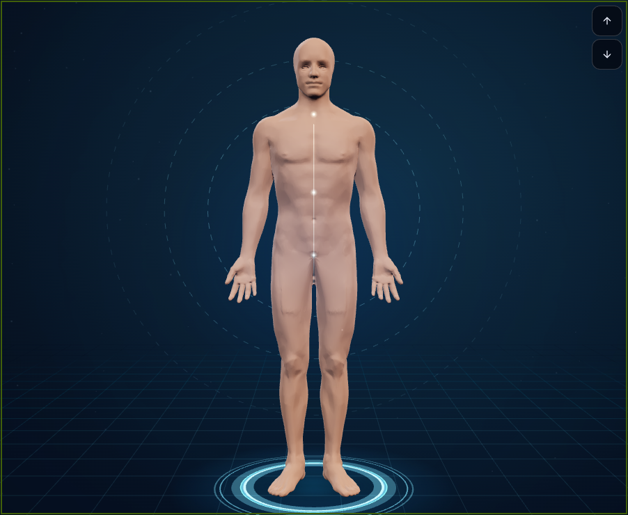

# PR151 exact-source navigation review

Application head: `299a9bc935de265e993d5531ac98dc2439d7cc54`. The subsequent picking-only candidate does not change application source.
Source: camera workflow 37825732615, artifact 11571560991, verified by actions/download-artifact against digest 048fec4f5713593ad931d30de6497edbccddf9c038c783f93f82773e4147efde.

All figures use synthetic absent evidence and the registered generic Body model, not a live account. Canvas stays intentionally dark in both page themes. The first two images compare identical body/camera geometry at old and new canvas heights. No image generation or retouching. The whole-page captures show actual controls and evidence copy.

## lt-dark-320-old-size.png

## lt-dark-320-larger.png

## lt-dark-320-full.png

## lt-light-390-lower-body.png

## en-dark-1280-full.png

## en-light-1280-larger.png

